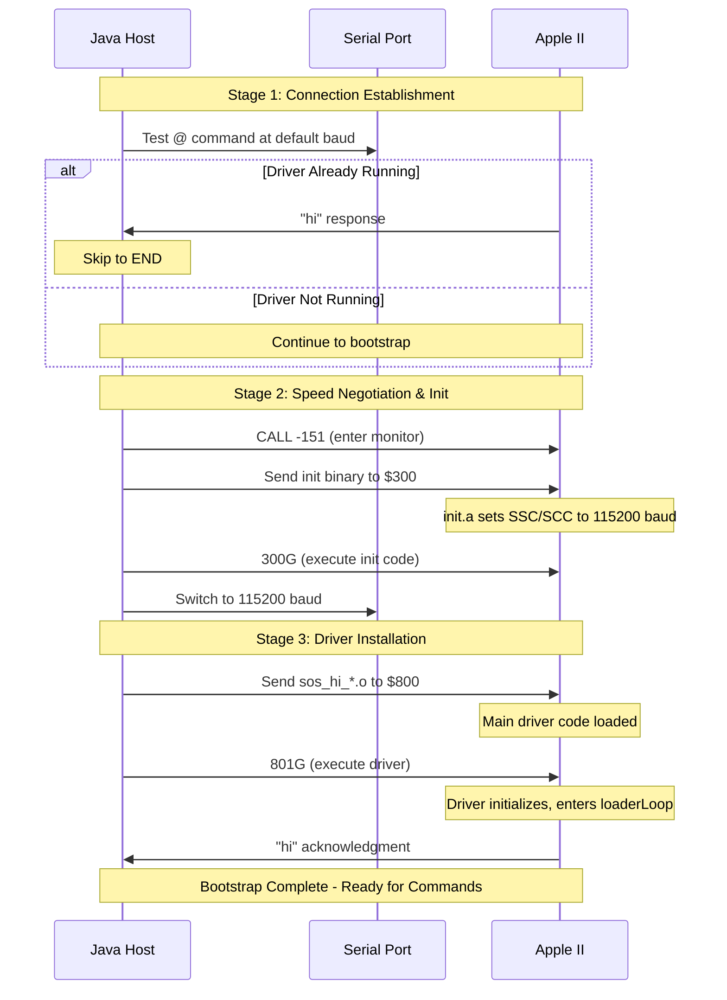
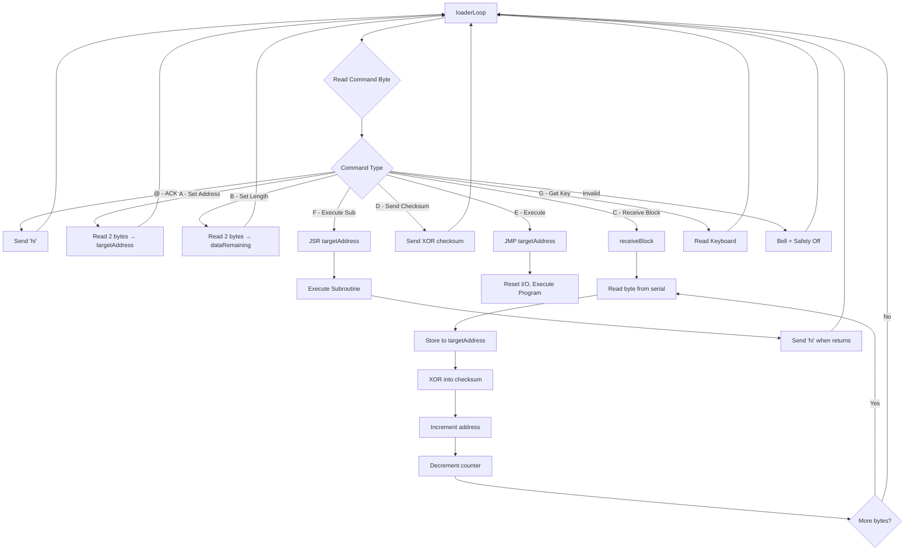
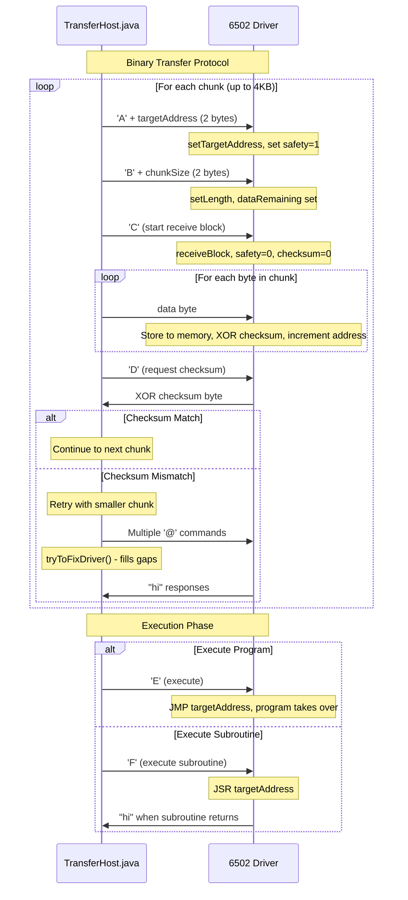

# Apple Game Server Communication Protocol Design

This document provides a comprehensive analysis of the Apple Game Server's communication protocol and binary transfer mechanisms, including detailed flowcharts and sequence diagrams explaining the complete lifecycle from bootstrap to game execution.

## Overview

The Apple Game Server uses a custom serial communication protocol to transfer games and programs to Apple II computers. The system consists of:

- **Java Host Application** (`TransferHost.java`) - Manages the PC side of communication
- **6502 Assembly Driver** (`sos_main.a`) - Runs on the Apple II to receive data and execute programs
- **Bootstrap Process** - Multi-stage initialization to establish reliable high-speed communication

## Protocol Architecture

### Command Structure

The protocol uses single-character commands sent from the Java host to the Apple II driver:

| Command | Purpose | Parameters | Response |
|---------|---------|------------|----------|
| `@` | Acknowledge/Test | None | `"hi"` |
| `A` | Set Target Address | 2 bytes (lo, hi) | None |
| `B` | Set Data Length | 2 bytes (lo, hi) | None |
| `C` | Receive Data Block | Data bytes | None |
| `D` | Request Checksum | None | 1 byte (XOR) |
| `E` | Execute Program | None | Control transfer |
| `F` | Execute Subroutine | None | `"hi"` on return |
| `G` | Get Keypress | None | 1 byte |

## 1. Boot Loader Stages

The bootstrap process establishes communication and loads the main driver through three distinct phases:



### Stage Details

1. **Connection Establishment**: Tests if the driver is already running by sending `@` and expecting `"hi"`
2. **Speed Negotiation**: Uploads initialization code that configures the serial port for high-speed (115200 baud) communication
3. **Driver Installation**: Transfers the main communication driver and starts it running

## 2. Runtime Communication Flow

Once the driver is loaded, it enters a command processing loop that handles data transfer and execution requests:



### Key Features

- **Safety Mechanism**: The `safety` flag prevents execution without proper address setup
- **Error Handling**: Invalid commands trigger a bell and disable execution safety
- **Subroutine Support**: Programs can return control to the driver for additional operations

## 3. Binary Blast-Loading and Execution Process

The core data transfer mechanism uses a chunked approach with error detection and recovery:



### Error Recovery Strategy

1. **Checksum Validation**: Each chunk is verified with an XOR checksum
2. **Adaptive Chunking**: Failed transfers retry with smaller chunk sizes (exponential reduction)
3. **Connection Recovery**: `tryToFixDriver()` sends burst of `@` commands to resynchronize
4. **Maximum Retries**: System aborts after `MAX_ERRORS_ALLOWED` (default: 10) consecutive failures

## 4. Implementation Details

### Java Side - Tight Loop (`TransferHost.java:140-191`)

The `sendRawData()` method implements the core transfer logic:

```java
while (offset < end && errors < MAX_ERRORS_ALLOWED) {
    // Send A-B-C sequence with data chunk
    writeQuickly("A");
    writeOutput(DataUtil.getWord(offset + addressStart));
    writeQuickly("B");
    writeOutput(DataUtil.getWord(useSize));
    writeQuickly("C");
    writeOutput(fileData, offset, size);
    
    // Verify with checksum
    byte[] checksum = computeChecksum(fileData, offset, size);
    writeQuickly("D");
    expectBytes(checksum, 500);
    
    // Handle success/failure
    if (checksum matches) {
        offset += chunkSize;
        errors = 0;
        chunkSize = MAX_CHUNK_SIZE;  // Reset to full size
    } else {
        errors++;
        chunkSize = chunkSize / 2;   // Reduce chunk size
        tryToFixDriver();            // Resynchronize
    }
}
```

### Assembly Side - Tight Loop (`sos_main.a:86-104`)

The `receiveBlock` routine stores incoming data:

```assembly
receiveBlock:
    LDY #$00
    STY safety      ; Engage safety (block execution)
    STY checksum    ; Initialize checksum
.finishBlock:
    +readByteInline ; Read next byte from serial
    STA targetAddress ; Store to target memory (self-modifying)
    EOR checksum    ; Update running checksum
    STA checksum
    INC targetAddress ; Increment target address
    BNE .decrementCounter
    INC targetAddress+1
.decrementCounter:
    DEC dataRemaining ; Decrement byte counter
    BNE .finishBlock
    DEC dataRemaining+1
    BNE .finishBlock
    BEQ loaderLoop  ; Return to command loop
```

## 5. Re-entry Hooks and Resilience Features

### Current Re-entry Mechanisms

1. **Subroutine Calls**: Programs can use 'F' command for JSR execution, returning control to driver
2. **Driver Testing**: '@' command provides connection validation with "hi" response  
3. **Error Recovery**: `tryToFixDriver()` sends burst of '@' commands to fill communication gaps

### Safety Features

- **Safety Flag**: Prevents execution without proper address setup (`safety` variable)
- **Checksum Validation**: XOR checksum detects transmission errors
- **Hardware Flow Control**: Prevents buffer overruns on slower connections
- **Timeout Handling**: Prevents indefinite waits during communication

### Potential Improvements

1. **Enhanced Error Recovery**
   - Adaptive timeout based on baud rate and chunk size
   - Better detection of specific error types (timeout vs corruption)
   - Progressive fallback to slower speeds for unreliable connections

2. **Re-entry Safety**
   - Stack canary detection for buffer overflows
   - Memory protection for critical driver areas
   - Watchdog timer for hung operations

3. **Flow Control Optimization**
   - Dynamic flow control switching based on connection quality
   - Buffer status reporting from Apple to Host
   - Congestion detection and backoff algorithms

4. **Protocol Extensions**
   - Multi-threaded transfers with sequence numbers
   - Compression support beyond the existing deflate system
   - Bidirectional file transfer capabilities
   - Remote debugging hooks with breakpoint support

## 6. Platform-Specific Variations

The system supports multiple Apple II models through different assembly variants:

### Super Serial Card (SSC)
- Uses ACIA 6551 chip at slot-relative addresses (`$C088 + slot*16`)
- Hardware flow control with RTS/CTS
- Supports slots 1, 2, 4, 5, 6, 7

### Apple IIgs Serial Ports  
- Uses Zilog SCC (Serial Communications Controller)
- Port 1: `$C03B/$C039`, Port 2: `$C03A/$C038`
- 16-bit addressing and register-based control

### Baud Rate Negotiation
- Initial: 300-19200 baud (model dependent)
- Bootstrap: Switches to 115200 baud for high-speed transfers
- Fallback: Maintains lower speeds for reliability when needed

## 7. File Organization

```
src/main/assembly/
├── init/init.a           # Bootstrap initialization code
├── sos/sos_main.a        # Main communication driver
├── ssc_routines.a        # Super Serial Card routines  
├── gs_routines.a         # Apple IIgs SCC routines
└── routines.a            # Common macro definitions

src/main/java/ags/
├── communication/
│   ├── GenericHost.java    # Base serial communication
│   └── TransferHost.java   # Binary transfer protocol
└── script/commands/
    ├── SendBinary.java     # Binary file transfer command
    └── SendTextBlind.java  # Text transfer command
```

This design enables reliable, high-speed transfer of games and programs to Apple II computers while maintaining compatibility across the entire Apple II family and various serial interface options.